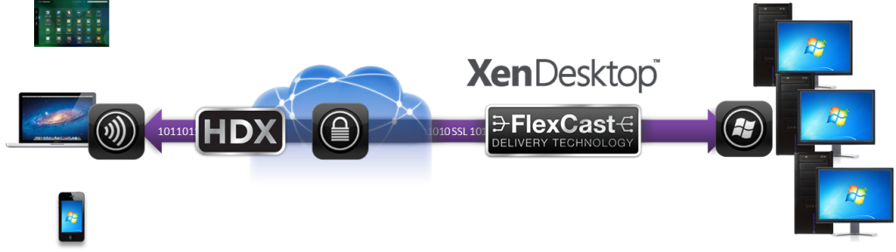

# [XenApp and Xen Desktop](https://www.citrix.com/products/sharefile/)

XenDesktop is a Virtual Desktop Infrastructure (VDI) which allows users to virtually access and run Microsoft Windows and Linux desktops from a datacenter or a public or private cloud, via devices located anywhere. Users are able to access virtual desktops and applications through XenApp using a locally installed client called Citrix Receiver. Virtual applications are delivered and managed via XenApp and virtual desktops are delivered and managed via XenDesktop.

Please refer to [this table](https://www.citrix.com/products/xenapp-xendesktop/feature-matrix.html) depicting features  available with your XenApp or XenDesktop licenses based on edition. For information on XenApp and XenDesktop features by key releases, please refer to the [XenApp and XenDesktop Release Feature Matrix](https://www.citrix.com/products/xenapp-xendesktop/release-feature-matrix.html). Details on XenApp and XenDesktop licensing are available in the [XenApp and XenDesktop Licensing FAQ](https://support.citrix.com/article/CTX128013). For more information on 7.15 LTSR baseline, compatible and excluded components and features, refer to the [product documentation](http://docs.citrix.com/en-us/xenapp-and-xendesktop/7-15-ltsr.html).

# Overview 

This repository serves to index and allows for navigation through the growing content specifically focused on Citrix XenApp and XenDesktop within the [Citrix-TechSpecialist](https://github.com/Citrix-TechSpecialist) GitHub organization. Here you can find tutorials, reference guides and auxiliary tools to better accustom yourself with Citrix XenApp / XenDesktop and how to configure and administer your deployment. 

# Index

Here is a manually updated list every time a new repository or collateral is published for quick navigation to relevant material. 

## Optimizing your User Experience

**[XenApp-XenDesktop-WEM-101](https://github.com/Citrix-TechSpecialist/XenApp-XenDesktop-WEM-101)**

In this lab, you will discover how to build a snappy user experience, increase user density on any XenApp, XenDesktop environments, and learn how to manage a fast logon time (<15 s) You will do the following:

  * Learn how to configure CPU/RAM/IOPS optimizations
  * Learn how to replace user GPPs and login scripts

## Azure

**[Citrix-Cloud-ResourceLocation-Arm-Template](https://github.com/citrix/Citrix-Cloud-ResourceLocation-Arm-Template)**

**This template is intended for demonstration deployments of Citrix XenDesktop on Azure.  As stated below, this will provision all of the resources necessary for a stand-alone deployment with a unique Active Directory domain.**

**This is not intended to integrate with an existing Active Directory domain, Azure Active Directory, or other existing resources**

This template creates a *fully self-contained* Citrix Cloud Resource Location compatible with Citrix XenDesktop with the XenApp and XenDesktop Service or Citrix XenDesktop Essentials Service trial licensing. A completed deployment from this template will consist of the following resources:

* Windows Server Active Directory Domain Controller
* Citrix NetScaler VPX 11.1
* Citrix Virtual Delivery Agent (VDAs)
	* Windows 10 HUB CBB (Client VDI golden image)
	* Windows Server 2016 (Server VDI golden image)
* Citrix Cloud Connector
* Jump Box / Bastian Host (VM built exclusively for remote access to the other resources)
* Azure Load Balancer
* Azure Virtual Network and Subnet
* Azure Storage Account
* Azure Availability Set
